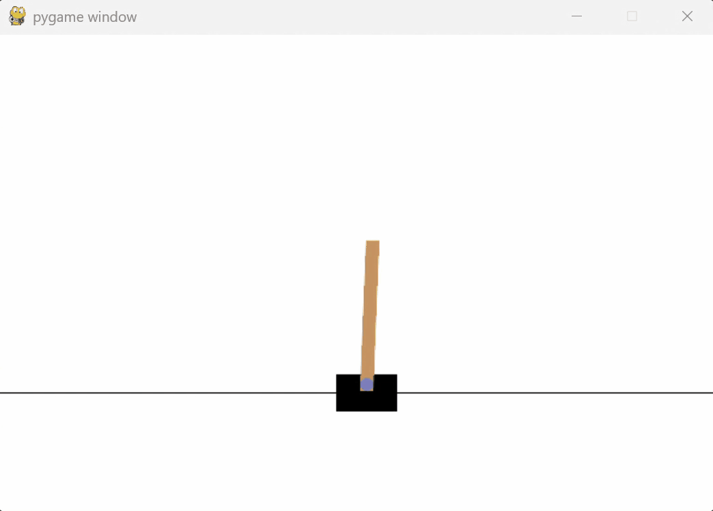

# Policy Gradient Methods from Scratch: REINFORCE (VPG), Baselines and GAE

This repository contains a from-scratch PyTorch implementation of several basic policy gradient algorithms, designed to solve the `CartPole-v1` environment from [Gymnasium](https://gymnasium.farama.org/).

The primary goal of this project is to gain hands-on experience with policy gradient methods by implementing them from scratch and by setting up experiments to explore their properties and trade-offs.

## Key Features & Implementations
- **REINFORCE (VPG):** Implementation using both full returns and future returns (rewards-to-go), using a stochastic policy $\pi_\theta$ based on a one-hidden layer MLP.
- **Value Function Baseline:** Implementation using future returns with a value function baseline, intended to reduce the variance of the policy gradient estimates. The value function is approximated by a one-hidden layer MLP.
- **Generalized Advantage Estimates (GAEs):** A full implementation of GAEs to provide a tunable bias-variance trade-off between TD(1)-errors and discounted future returns with value function baseline.
- **Experimentation Framework:** Includes TensorBoard logging for detailed analysis of training runs, including reward curves.

## Demo: Trained Agent in Action



## Setup & Usage

### 1. Installation
First, clone the repository and set up the Python environment.

```bash
git clone https://github.com/NN41/policy_gradient_methods.git
cd policy_gradient_methods
pip install -r requirements.txt
```

### 2. Running a Single Training Loop
To run a quick, single training loop with the default hyperparameters:

```bash
python main.py
```

This is a great way to test the setup and watch the agent learn. The configurations can be adjusted within `main.py` when instantiating the `Config` class. Training metrics are stored directly in the `runs/` directory and can be visualized in TensorBoard.

### 3. Running Experiments (Hyperparameter Sweeps)
For more systematic exploration and to reproduce the findings in this repository, use the `run_experiments.py` script.
1. **Configure Your Experiment:** Open `src/run_experiments.py` and modify `base_config` to set the configs and `param_grid` dictionary to define the hyperparameter sweep you want to run.
2. **Execute the Experiment:** Run the following command from the project's root directory:
```bash
python -m src.run_experiments
```

### 4. Monitoring with TensorBoard
All experiment results, including learning curves, weight variances and parameter distributions, are logged to the `runs/` directory. To view them in a structured way, start TensorBoard:
```bash
tensorboard --logdir runs
```

## Background & Implementation

This section provides a brief overview of policy gradient methods and their implementation in this project. This project is based on the theory from OpenAI's [Spinning Up in Deep RL](https://spinningup.openai.com/en/latest/index.html) and the 2016 paper [High-Dimensional Continuous Control Using Generalized Advantage Estimation](https://arxiv.org/abs/1506.02438) by Duan et al.

### Policy Gradient Methods
Policy gradient methods are one of the simplest ways to do reinforcement learning. These methods optimize a parametrized policy $\pi_\theta$ with the goal of maximizing the expected return $J(\pi_\theta) = E_{\tau\sim\pi_\theta}[R(\tau)]$, where $\tau$ is a trajectory sampled from the policy $\pi_\theta$. In this project, $R(\tau) = \sum_{t=0}^T r_t$ is the undiscounted finite-horizon return of the trajectory. The core idea of policy gradient algorithms is to update the policy parameters $\theta$ through gradient ascent. The policy gradient theorem allows us to write the policy gradient $\nabla_\theta J(\pi_\theta)$ as $E_{\tau\sim\pi_\theta}[\sum_{t=0}^T\nabla_\theta\log\pi_\theta(a_t|s_t)\Psi_t]$. We can estimate this quantity by collecting trajectories by sampling $\pi_\theta$ and taking the sample mean of the $\nabla_\theta\log\pi_\theta(a_t|s_t)\Psi_t$. Here, $\Psi_\theta$ is the "weight", which represents the quality of taking action $a_t$ in state $s_t$. Intuitively, if an action $a_t$ is associated with a high weight, it's considered 'good' and its likelihood will be pushed up. Similarly, if an action is considered 'bad' according to the weight, its likelihood is pushed down.

The choice of the weight $\Psi_t$ is critical and determines the trade-off between bias and variance in the gradient estimate. This project implements several common choices for $\Psi_t$ from scratch:
- **Full Returns (`weight_kind='r'`)**: $\Psi_t = R(\tau) = \sum_{t'=0}^Tr_{t'}$. Used in the original REINFORCE algorithm. It is an unbiased estimate, but suffers from high variance, because a single luck or unlucky action late in an episode can drastically change the returns for all preceding actions.
- **Future Returns (Rewards-to-Go) (`weight_kind='fr'`)**: $\Psi_t = \sum_{t'=t}^Tr_{t'}$. A more sensible choice for $\Psi_t$, since it only focus on the consequences (the future returns) of taking action $a_t$. This is the "vanilla" policy gradient (VPG) implementation. It is unbiased as well, but has slightly lower variance. Also has a discounted version, implemented as `weight_kind='dfr'`.
- **Future Returns with a Value Function Baseline (`weight_kind='dfrb'`)**: $\Psi_t = \left(\sum_{t'=t}^T\gamma^{t'-t}r_{t'}\right)-V_\phi(s_t)$. Here, we subtract a baseline from the discounted future returns. In this project, we approximate the on-policy value function $V^\pi$ by an MLP $V_\phi$ trained to reduce an MSE loss with respect to future returns sampled from the parametrized policy $\pi_\theta$. A *good* estimate of the value function can significantly reduce variance wihtout introducing bias.
- **Generalized Advantage Estimation (GAE) (`weight_kind='gae'`)**: $\Psi_t=\text{GAE}_t(\gamma,\lambda) = \sum_{t'=t}^T(\gamma\lambda)^{t'-t}\delta_{t'}$, where $\delta_t$ is the TD(1) error. The GAE paper introduces a scheme to smoothly interpolate between the low-variance (but biased) one-step TD error and the high-variance (but unbiased) future returns with a value function baseline. The parameter $\lambda$ controls this bias-variance trade-off. In particular:
  - For $\lambda=0$, we get the TD(1) error $\Psi_t=\delta_t=r_t + \gamma V_\phi(s_{t+1}) - V_\phi(s_t)$, implemented as `weight_kind='td'`.
  - For $\lambda=1$, we get the future with a value function baseline `weight_kind='dfrb'`.

### Role of GAE Parameters
As discussed in the GAE paper, both $\gamma$ and $\lambda$ control the amount of bias we introduce in the system. However, they control different types of biases.

The first bias is introduced by changing the problem we are solving and is controlled by the discount factor $\gamma\in[0,1]$. When $\gamma<1$, it replaces the original problem of maximizing the expected *undiscounted* return $E\left[\sum_{t=0}^Tr_t\right]$ by the proxy problem of maximizing the expected *discounted* return $E\left[\sum_{t=0}^T\gamma^tr_t\right]$. By shrinking the magnitude of rewards from the distant future, we are stabilizing learning signals by making the return less sensitive to uncorrelated random events that might occur far in the distant future. This does introduce some bias. In this project (within the `CartPole-v1` environment), however, this bias is inconsequential, because solving the proxy problem solves the original problem as well, due to the constant and immediate nature of the feedback loop. The agent receives one point for every time step it survives, so receiving $X$ points on the discounted problem implies receiving even more points on the original, undiscounted problem.

The second bias is introduced by using an incorrect estimator for the true value function. Looking at the GAE formule, we have to replace the true value function $V^{\pi_\theta}$ a neural network $V_\phi$, which is always going to be an approximation. Therefore, the TD errors we calculate are not the true TD errors, i.e. it's a biased estimate. The parameter $\lambda\in[0,1]$ provides a sliding scale between reducing variance or reducing this bias.
- When $\lambda=1$, the GAE estimate reduces to the discounted future return with a baseline $V_\phi$. It is well-known that we may include baselines without changing the expectation of the policy gradient estimate. As such, no matter how bad your approximation $V_\phi(s_t)$ is, the estimate remains unbiased for the *proxy* problem. However, the estimate has high variance, especially if $V_\phi$ is insufficiently or particularly badly trained.
- When $\lambda=0$, the GAE estimate reduces to the one-step TD error. As we mentioned above, this is a biased estimate, so the final GAE estimate is biased as well. At his, however, very low variance. By varying $\lambda$ between $0$ and $1$, you can choose the trade-off between this variance and the bias. The GAE paper finds generally finds best performance when $\lambda \in [0.9, 0.99]$. 

### Implementation Details
In this project, we parametrize the policy and value function by one-hidden layer MLPs with hidden-layer ReLU activation. For the value function network, we use MSE loss with respect to discounted future returns. We optimize both networks using Adam.

## Experiments & Results
The hyperparameters and training metrics of each training run are stored in the folder `\runs\experiment_group\run`, where `experiment_group` and `run` are respectively chosen by the user or created at runtime. 

### Experiment 1: Policy Hyperparameters Grid Search
We perform a grid search to find the hyperparameters that allow us to train the policy network to achieve good performance in a reasonable amount of training time. The objective is to find a good benchmark that exhibits stable but noticeable improvement with a manageable training time.

We train an agent to solve the environment through REINFORCE (VPG), using undiscounted future returns as the weights (`weight_kind=fr`). Using this bare-minimum set up gives us a benchmark to compare other methods against.

We perform a grid search by choosing the number of episodes per epoch from $[10,20,50]$, the learning rate from $[0.001,0.01,0.1]$ and the number of hidden neurons from $[2,4,8]$. We run 50 epochs. In the following figure taken from Tensorboard, we show a single run for each parameter combo from the Cartesian product, each run using the same seed.


Each color corresponds to a tuple (learning rate, hidden size), with multiple lines of the same color representing varying degrees of episodes per epoch. We note the following:
- The upper band (pink, blue, black) represent a learning rate of 0.1 and quickly achieves maximum performance of 500 return after roughly 30 epochs, albeit with massive variance within and across runs. Due to this instability, we discard this learning rate.
- The lower band (orange, black, blue) represents a learning rate of 0.001. It is clear that this learning rate is too little to make any meaningful progress and is discarded as well.
- The middle band (green, purple, yellow) represents a learning rate of 0.01, giving us a good trade-off between stability and noticeable improvement over time. 

In all cases, increasing the number of hidden neurons increases the improvement per epoch, since at each gradient ascent step we have more network weights to update. In this project, the biggest driver of training time is not the complexity of the networks, but the total number of steps we have to simulate per epoch. As such, to allow for maximum flexibility, we choose 8 hidden neurons for the policy network, corresponding to the green line. The three green lines correspond to varying number of episodes per epoch. In general, using 10 episodes lead to slightly more instability and using 50 episodes leads to slightly quicker performance improvement due to increased likelihood of highly lucky episodes (at the cost of higher training time), which have an disproportionally positive effect on training due to using future returns as weights. We choose the middle ground of 20 episodes per epoch. The GAE paper also chooses this number in their CartPole experiment. 

As mentioned above, the biggest driver of training time is the number of steps we have to simulate. As a side effect, more successful runs require more simulation steps and thus require way more time to train. As an agent becomes better, it becomes more time-consuming to train it. This is an extra argument to choose the green line, giving a good balance between quick training time and decent performance. 

### Experiment 2a: Agent Performance Collapse
While investigating the comparative performance of the weight types `dfr`, `dfrb` and `gae`, it became obvious there the value function is suffering from severe training issues. I observed only two outcomes:
1. You undertrain the value function to such an extent that it basically doesn't get trained at all (that is, test error improvement per training loop was in the range of 0.05%-0.50%). Under this circumstance, all methods approximately reduce to the `dfr` method and you might as well not include the value function at all.
2.  You train the value function normally. Initially, the agent improves on par with the `dfr` baseline, but after a few epochs, its performance disastrously collapses to 0.

Apart from a few rare exceptions, I was unable to tweak the hyperparameters (learning rate, number of epochs, weight decay, number of episodes per epoch) to *reliably* achieve any other training outcome than the aforementioned two. 

In this experiment, I will demonstrate the agent performance collapse by varying the learning rate of the value function baseline. I used 20 hidden neurons (similar to the GAE paper), 3 epochs to train the value function, and the policy hyperparameters from Experiment 1. The characteristic results are displayed in the following figure.


The figure shows a single run for varying levels of value function learning rate, as well as a `dfr` benchmark (upper black line). The performance of the agent follows a very predictable pattern: the larger the learning rate (i.e. the more the value function learns to fit the data), the quicker the agent performance collapses. We note a few distinct outcomes in the figure above:
- The agent's performance collapses after a clear critical point and doesn't recover anymore. This is the case for learning rates 0.01 (pink), 0.005 (blue), 0.001 (lower black), 0.0007 (orange). As the learning rate decreases, the critical point shifts to the right.
- The agent's performance degrades after a clear critical point but doesn't clearly collapse or recover. This is the case for learning rates 0.0004 (green) and 0.00034 (purple). It is difficult from this experiment to confidently say what would happen if we had extended the number of epochs. In any case, if these learning rates do indeed lead to an equilibrium, this equilibrium is extremely brittle and highly dependent on the other hyperparameters. However, most importantly, the `dfrb` weight severely underperforms the much simpler `dfr`.
- The agent's performance stays on par with the `dfr` method because the value function is undertrained to such a degree, we might as well have omitted it. This is the case for learning rate 0.0001 (yellow). Some experimentation with slightly higher learning rates (0.0002) suggest that even these learning rates eventually lead to collapse, it just happens after the 70 epochs that we trained.

We hypothesize that the root cause of the performance collapse is a rapid improvement in the policy combined with an overly optimistic and stale value function. The downward spiral unfolds as follows:
1. The policy network improves rapidly, learning to achieve, for instance, an average return of 250. The value function, trained on this good data, learns to associate certain states $s_t$ with this high value.
2. In the next batch of episodes, an unlucky trajectory encounters the same state $s_t$ but, due to stochasticity, only achieves a future return of 50.
3. The value function, still using its *stale* and optimistic estimate from the previous iteration, confidently predicts a value of 250. This creates a massive negative advantage ($50 - 250 = -200$). Consequently, the learning algorithm concludes that the action $a_t$ taken was catastrophically bad and strongly pushes down its probability. The policy is thus severely punished for failing to meet the stale expectations set by the value function.
4. This is the critical step that triggers the collapse. The punishing update causes the policy to stop exploring that action entirely, and instead it will choose the bad action $b_t$ in state $s_t$ from that point onward. The agent may now never rediscover that action $a_t$ was actually not that bad, just part of an unlucky episode. 
5. This initial damage starts a self-reinforcing spiral. The policy now generates worse trajectories, which lowers the prediction of state $s_t$'s value, let's say to 150, down from 250. Imagine now that we achieve an unusually lucky trajectory with return 250 again going through that same state $s_t$. Not only will the algorithm reinforce the bad action $b_t$ (since the policy is now avoiding $a_t$ after having been punished), it will also reinforce it to a unreasonable extent, since now the value function now confidently indicates an advantage of $250-150=100$, instead of the $250-250=0$ it would have in the previous round. Thus, the algorithm starts reinforcing suboptimal trajectories, leading to even worse-quality data. The entire system loses its ability to explore and recognize high-reward outcomes, leading to total performance collapse. 

This stability problem is well-known, so methods such as Trust Region Policy Optimization (TRPO) and later Proximal Policy Optimization (PPO) were developed, which limit how much the policy can change from one update to the next. The GAE paper, for example, uses TRPO to stabilize the training process. Implementing these methods was out of the scope of this project.

### Experiment 2b: Semi-Stable Performance Collapse
*(Note: This is a later addition to Experiment 2b.)* After observing the semi-stable performance states for intermediate learning rate values, I decided to extend it past 70 policy training epochs.

In the figure below, we display a single training run for a variety of learning rates, trained for 200 policy epochs. The learning rates are in the ranges [0.0001, 0.0002) (black), [0.0002, 0.0003) (blue), [0.0003, 0.0004) (pink), [0.0004, 0.0005) (yellow) and 0.0005 (purple).


Without going into too much detail, it turns out that the training performance is very chaotic for intermediate values of the learning rate. From one learning rate to the next, e.g. from 0.00044 to 0.00046, the performance might stabilize or completely collapse. The higher the learning rate, the more likely is total collapse. Towards the lower end of these intermediate values, the performance usually oscillates a few times before either stabilizing, recovering or collapsing. 

### Experiment 3: Variance of Weight Types
While discussing policy gradient methods and the various weight types $\Psi_t$, much of that is motivated by trying to pick $\Psi_t$ in such a way that we end up with low-variance weights.

Even though we concluded in Experiment 2 that we cannot successfully train a value function network with the current implementation, we may still take a moment to inspect the variances of the various weight types.

In the figures below, we plotted the the variances of the weight types "Full_Returns" (`weight_kind=r`), "Future_Returns" (`fr`), "Disc_Future_Returns" (`dfr`), "DFR_Baseline" (`dfrb`), "GAEs" (`gae`) and "TD_Errors" (`td`).


 

In this implementation, for a given training run we compute *all* weight types, but obviously only use one for the policy gradient estimate. For completeness, we picked several characteristic training runs. In particular, we plotted runs with the following hyperparameters:
- Black: `weight_kind=dfr` as a benchmark (no value function is used).
- Blue:`weight_kind=dfrb`, with learning rate $0$ (value function is initialized, but never updated).
- Pink: `weight_kind=dfrb`, with learning rate $0.0001$ (value function is updated, but severly undertrained).
- Green: `weight_kind=dfrb`, with learning rate $0.001$ (value function overfits and agent collapses after 30 epochs).

First of all, to compare the variances of weights, it's important to pick a single color and compare the variances at a specific epoch across the six different figures. We note the following.
- For `r`, `fr`, `dfr`, `dfrb` the variance is highly correlated with the performance of the agent. As the agent learns to stay alive longer, any weight that includes a sum of rewards grows in lock-step. Then the variance grows simply due to larger magnitude of numbers in combination with natural randomness of actions taken.
-  By picking a single color and a specific epoch, let's say pink around the 60th epoch, we can see that the variance varies wildly from one weight type to the next: full returns and future returns are on the order of 10k and 1k, respectively. For `dfr`, the variance initially increases as the agent improves, but then flattens when the discount factor neutralizes any extra rewards from increased performance in the distant future. 
-  Counterintuitively, `dfrb` has worse variance than `dfr`, even though the first subtracts a value function baseline! This can be explained by considering that $Var(DFR-B) = Var(DFR) + Var(B) - 2Cov(DFR,B)$ and reminding ourselves that the baseline is being severely undertrained. Because of this, the covariance term is roughly 0 and the value function baseline actually ends up *adding* variance due to its random initialization. 
- The plot of variances for `gae` should be ignored here for blue, green, and pink. In the context of this experiment, $\lambda$ was set to 1, so the `gae` weights simply reduce to `dfrb` weights. For the black line, we did use $\lambda = 0.96$. We note that the variance is 1 order of magnitude smaller than for `dfrb` and 4 orders larger than for `td`. This is in line with the theory, that establishes $\lambda$ as a slider to choose the level of variance and bias.
- As expected, the TD errors have the lowest variance of all weight types. When the value function does not get trained at all (black, blue), the variance doesn't change either over the course of training. However, when there is training happening, no matter if it's too much or too little, we see the TD error variance increase as the value function learns some structure. 

## Conclusion
In conclusion, the clear winner is `weight_kind=dfr`, or discounted future returns. Not only is the variance of the weights 1-2 orders of magnitude below those of full returns or future returns, it also completely circumvents the problem of having to train a value function network, while achieving great performance with minimal implementation effort.

Until more advanced methods are implemented that solve the training issues of the value function network (such as TRPO or PPO), the discounted future returns are the way to go for solving the `CartPole-v1` environment.

## Key Learnings & Obstacles
This project was a valuable learning opportunity, even though it was frustrating at times. Not only did I gain hands-on experience with policy gradient algorithms, parsing and implementing research papers and writing robust code, I also learned a lot about time boxing, iterating, goal setting, documenting and pragmatic working. It was easy to implement a first version of the policy gradient algorithms. The main challenge came when the value function was not learning as expected (for the reasons mentioned before). I spent a lot of time going over my code looking for bugs, tweaking hyperparameters and running lengthy experiments to understand failure modes, going through papers and online material, and discussing my problems with AI. When I accepted the inherent shortcomings of the value function algorithms, my initial experimental goals became obsolete and I spent some time figuring out what the goal of my project would be instead. Looking back, I should have discussed my problems with AI earlier to come up with hypotheses of what was going wrong, as well as set out better criteria beforehand of what would constitute a finished project to avoid feature creep.

A other, minor highlights:
- **Start small, then iterate.** I thought I was smart by using a ReLU output activation for the value function network, since in `CartPole-v1` the returns can only ever be strictly positive. This would regularly lead to the value function not being trained, since it would be initialized with all its outputs negative, giving zero gradients. This shows that it's important to start with something small and working, and only add complexity in iterations.
- **Stay critical of AI help.** While implementing random seeds for reproducibility, the LLM confidently suggested a solution. Critically inspecting the output of the training runs, it was clear that its solution was not working. Even pushing the LLM, it was unable to find the right solution. I had to manually go through the gymnasium documentation to find the right solution.
- **Decide beforehand what is enough**. The initial idea was to investigate the comparative performance of the various weight methods, in particular of the future returns (rewards-to-go), value function baselines and GAEs. When the inherent instability in training the value function network became clear, I spent a lot of time running different experiments without a clear goal in mind, leading to a lot of unncessary delays. Instead, I should have taken more time planning out the new project goals and confidently working towards those. This also avoids feature creep.  

## Future Work
- [ ] Implement unit tests.
- [ ] Refactor the `Trainer` class to move all relevant external functions to within this class.
- [ ] Implement TRPO and PPO.
- [ ] Refactor the data collection loop to collect a fixed number of steps rather than a fixed number of episodes, to normalize training time.
- [ ] Test the implemented agents on more complex environments like `Acrobot-v1` or `LunarLander-v1`.
- [ ] Investigate using a shared network body for both policy and value function learning, which could allow for more efficient feature learning.


